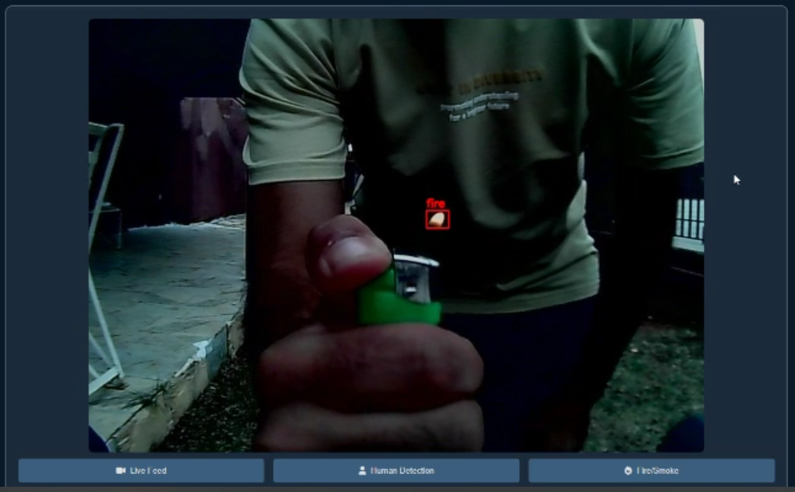
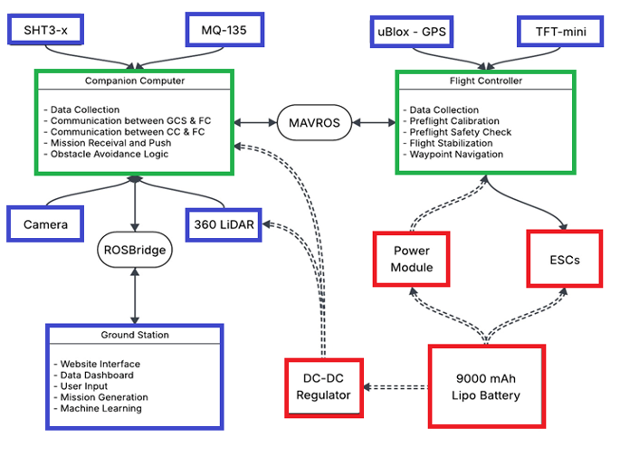
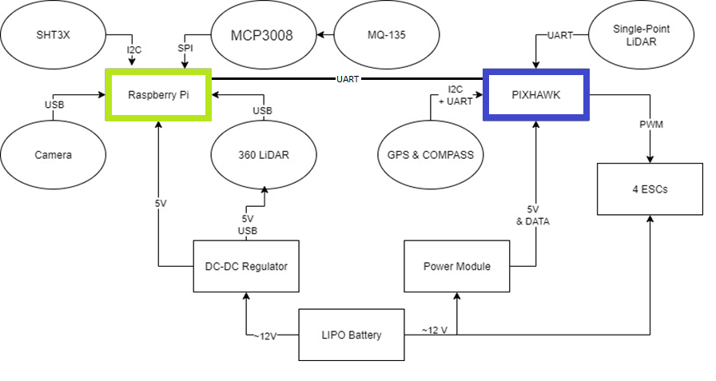
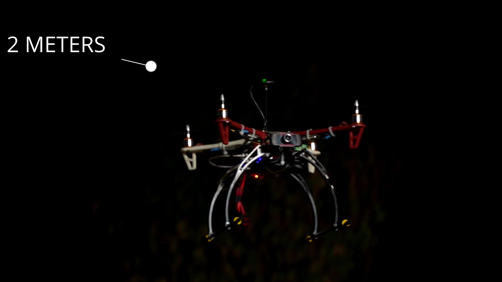

Voici le contenu complet, prêt à copier-coller directement dans l'éditeur GitHub :

markdown
# Autonomous UAV System for Rapid Disaster Reconnaissance

**Final Year Project — La Sagesse University (2025) — Grade: A+**
**Technical Lead:** Wadih Dahrouge · Team: Amine Batrouni, Houssam Hamdan
**Supervisor:** Dr. Eng. Roy Abi Zeid Daou

> A fully autonomous, self-funded UAV built to navigate GPS-denied, hazardous environments — detecting fire, locating victims, and streaming real-time situational awareness to first responders without a human pilot.
>
> Formally presented to and recognized by the **Lebanese Civil Defence**, whose representative described the system as *"very interesting and indispensable"* for Lebanon's wildfire response — citing the absence of institutional funding, not the engineering, as the only barrier to real-world deployment.

---

## Why this project exists

Lebanon faces recurring wildfires and disaster scenarios (including the aftermath of the 2020 Beirut port explosion) where traditional search-and-rescue is slowed by traffic, hazardous terrain, and risk to rescue teams. This project set out to close that gap with a modular, autonomous UAV that plans its own path, avoids obstacles in real time, and detects fire, smoke, and human presence on its own — self-funded, with no institutional backing.

It was designed, built, and flight-tested during a period of active regional conflict in Lebanon (2024–2025), which caused frequent GNSS and network disruption and restricted outdoor flight testing — pushing much of the validation onto simulation before every constrained real-world flight window.

## Results

| Metric | Result |
|---|---|
| Human detection accuracy (YOLOv8) | **92%** |
| Fire detection accuracy | **80%** |
| Flight endurance | **18 minutes** |
| Total assembled weight | **1.4 kg** |
| GPS positioning accuracy (field test) | **±2–3 m** |
| Obstacle avoidance precision (360° LiDAR vs. ground truth) | **±2 cm** |
| Environmental sensor accuracy | Humidity ±0.5% · Temperature ±2–3% · Air quality ±4.5 AQI |

Validated across bench-level hardware checks, QGroundControl / Mission Planner simulated missions, and real-world autonomous flights — autonomous takeoff, multi-waypoint navigation, live obstacle avoidance, and return-to-launch.

  
   <em>Real-time fire/smoke and human detection during flight testing</em>

## System architecture

  

- **Flight control:** ArduCopter firmware on a Pixhawk 2.4.8, bridged to the companion computer via **MAVLink/MAVROS**
- **Autonomy stack:** ROS2 nodes for mission execution, navigation, and obstacle avoidance, running on a Raspberry Pi 4B
- **Perception:** 360° LiDAR (YDLiDAR X4 Pro) for obstacle mapping and avoidance; front-facing camera for live video
- **Detection:** YOLOv8 for human detection, a pretrained CNN for fire/smoke detection — inference offloaded to the ground station server for real-time performance
- **Ground station:** Flask backend + web frontend (Leaflet map), communicating over WebSocket/Rosbridge — mission planning, live telemetry, and detection overlays
- **Sensing:** GPS/compass, landing LiDAR, air quality (MQ-135), temperature/humidity (SHT3-X)

  

## Repository structure

.
├── drone/ # Onboard ROS2 packages (Raspberry Pi)
│ ├── navigator_pkg/ # Mission parsing, waypoint execution, flight-mode control
│ ├── obstacle_avoidance/ # 360° LiDAR-based real-time avoidance logic
│ ├── perception/ # YOLOv8 human detection + fire/smoke CNN inference
│ └── mavros_bridge/ # MAVLink <-> ROS2 bridge configuration
├── ground_station/ # Flask backend + web frontend
│ ├── server/ # Mission planning, telemetry, Rosbridge relay
│ └── ui/ # Live feed, human/fire detection panels, mission control
├── hardware/ # CAD files, wiring diagrams, bill of materials
├── docs/ # Full technical report, technical summary, presentation
└── media/ # Flight test footage, screenshots

*(Adjust to match your actual folder layout before publishing — this is the recommended structure if reorganizing.)*

## Real-world testing

  
   <em>Autonomous obstacle-avoidance test — 360° LiDAR-triggered evasive maneuver at close range</em>

Testing progressed through bench validation → simulated missions (QGroundControl/Mission Planner) → constrained real-world flights, including:
- Manual flight and IMU/ESC calibration
- No-propeller mission validation (safety-first testing under restricted flight conditions)
- Open-field autonomous missions: takeoff, multi-waypoint navigation, live obstacle avoidance, return-to-launch

## Constraints and lessons learned

- **Self-funded, no institutional support** — every component was personally financed by the team, with the Technical Lead covering the majority of costs.
- **Built under wartime conditions** — active regional conflict disrupted GNSS/network availability and restricted outdoor flight testing, shaping a simulation-first validation strategy.
- **Limitations identified:** ~18-minute flight endurance (battery/weight constrained), Raspberry Pi 4B compute bottlenecks under multi-node ROS2 load, thermal camera integration and full 3D SLAM mapping were not completed in this iteration.
- **Future work:** stereo vision, thermal camera integration, secure communication links, multi-UAV swarm coordination.

## Full documentation

- [Final Year Project Report](docs/Autonomous_UAV_system_final.pdf) — full thesis (state of the art, hardware/software design, testing chapters)
- [Technical Summary](docs/Wadih_Dahrouge_UAV_Technical_Summary.pdf) — one-page overview for research/industry audiences

## Author

**Wadih Dahrouge** — Mechatronics Engineer, autonomous systems & UAV robotics
[wadihdahrouge1@gmail.com](mailto:wadihdahrouge1@gmail.com) · LinkedIn: *[add link]*
