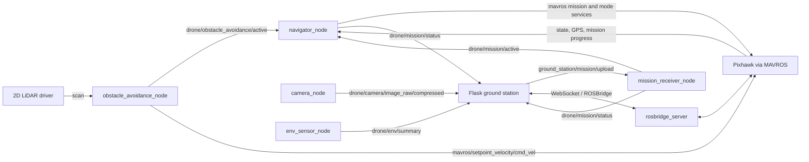
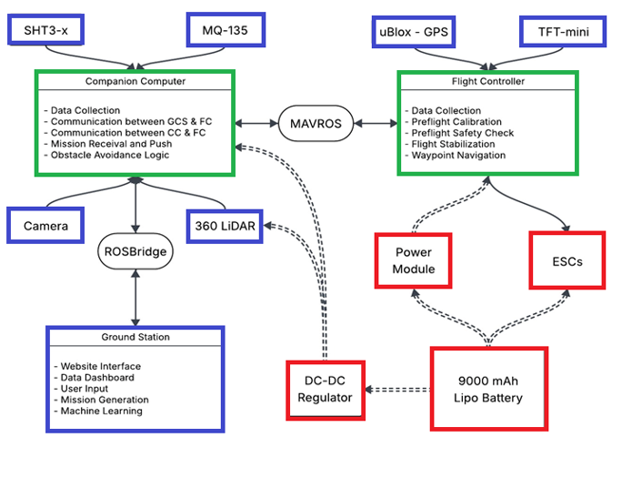
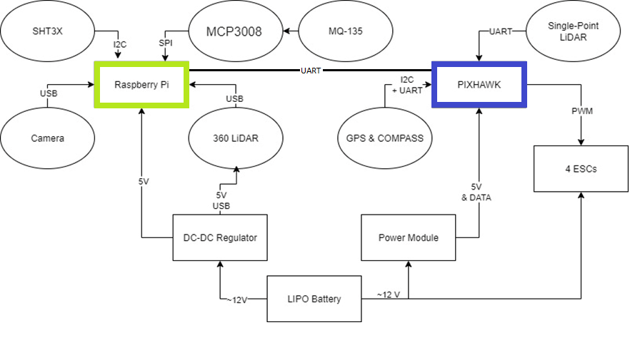
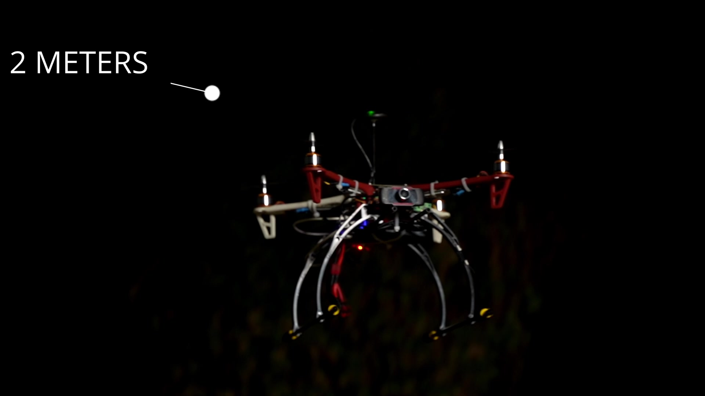

# Autonomous UAV System for Rapid Disaster Reconnaissance

[](https://github.com/wadih553/autonomous-uav-disaster-recon/actions/workflows/python-checks.yml)
[](LICENSE)


**Final-year project · La Sagesse University · 2025 · Grade: A+**  
**Technical lead:** Wadih Dahrouge · **Team:** Amine Batrouni, Houssam Hamdan  
**Supervisor:** Dr. Eng. Roy Abi Zeid Daou

A self-funded UAV prototype exploring disaster reconnaissance with ArduPilot/Pixhawk flight control, ROS-based components, a 2D LiDAR obstacle-sensing pipeline, environmental sensors, computer-vision experiments, and a web-based ground station.

The project was presented to the **Lebanese Civil Defence**. A representative described the concept as *“very interesting and indispensable”* for wildfire response. The prototype was developed under limited funding and constrained outdoor-testing conditions.

> **Portfolio scope:** This repository contains selected project artifacts and a research-oriented software implementation. It is **not a turnkey, fully reproducible deployment**. Source code, report descriptions, and historical project summaries do not by themselves establish that every described subsystem was integrated or validated on flight hardware.

---

## Project motivation

Wildfires and other emergencies can put responders at risk and make rapid situational awareness difficult. The project explored a UAV workflow combining waypoint missions, obstacle sensing, video streaming, environmental measurements, and human/fire perception.

GNSS reliability and restricted opportunities for outdoor testing were important project constraints. The project report describes simulation, bench checks, and constrained real-world flights using GNSS-guided waypoint navigation. **This repository does not demonstrate validated GNSS-denied navigation or a completed full 3D SLAM system.** The YDLIDAR X4 Pro used in the project is a 2D scanning LiDAR.

## Results and evidence

The final-year report gives the following project figures. They should be read with their original context; the repository does not contain a complete benchmark dataset or test protocol to independently reproduce them.

| Item | Context |
|---|---|
| Flight endurance: about 18 minutes | A calculated estimate in the report for a moderate-load scenario, not a claim of independently measured endurance |
| Assembled mass: about 1.4 kg | Reported component/assembly weight estimate |
| GPS measurement: approximately ±3 m | Figure stated in the report's sensor-measurement table |
| Environmental sensor readings | The report includes example comparisons for humidity, temperature, and air-quality readings |
| Human/fire detection | The report describes machine-learning-based detection, but this repository does not include the trained model weights or a reproducible evaluation suite; no detection-accuracy percentage is claimed here |
| Obstacle distance | The report describes a ±2 cm target tolerance in its test procedure; that should not be interpreted as an independently verified accuracy result from this repository |

## System architecture

The following dataflow is based on the topics used by the current source code. It is a software-level view, not proof that every node has been launched together or validated on hardware.


```mermaid
flowchart LR
    L[2D LiDAR driver] -->|scan| OA[obstacle_avoidance_node]
    OA -->|drone/obstacle_avoidance/active| NAV[navigator_node]
    OA -->|mavros/setpoint_velocity/cmd_vel| FC[Pixhawk via MAVROS]
    GS[Flask ground station] -->|ground_station/mission/upload| MR[mission_receiver_node]
    MR -->|drone/mission/active| NAV
    NAV -->|mavros mission and mode services| FC
    FC -->|state, GPS, mission progress| NAV
    CAM[camera_node] -->|drone/camera/image_raw/compressed| GS
    ENV[env_sensor_node] -->|drone/env/summary| GS
    MR -->|drone/mission/status| GS
    NAV -->|drone/mission/status| GS
    GS <-->|WebSocket / ROSBridge| RB[rosbridge_server]
    RB <--> FC
```


<p align="center">
  
</p>

- **Flight controller:** Pixhawk 2.4.8 running ArduCopter/ArduPilot firmware.
- **Companion computer and robotics middleware:** Raspberry Pi 4B and ROS/ROS 2 components, as reflected in the project materials and current code.
- **Flight-control interface:** MAVLink/MAVROS.
- **Obstacle sensing:** YDLIDAR X4 Pro 2D scanning LiDAR; a camera provides video.
- **Perception:** Human detection can use a local Ultralytics YOLO model. Fire/smoke detection is disabled unless a compatible Ultralytics object-detection model is explicitly configured. The project's named CNN weights are not assumed to be compatible with YOLO. No trained weights are included.
- **Ground station:** Flask, Flask-SocketIO, a web interface using Leaflet, and ROSBridge communication.
- **Additional sensing described in the report:** GPS/compass, landing-distance sensing, MQ-135 air-quality sensor, and SHT3-X temperature/humidity sensor.

<p align="center">
  
</p>

## Flight testing

<p align="center">
  
</p>

The report describes a test sequence involving:
- Bench checks and IMU/ESC calibration.
- Mission simulation using QGroundControl/Mission Planner.
- Safety-constrained tests, including no-propeller mission validation.
- Constrained outdoor flights involving takeoff, waypoint navigation, and return-to-launch.
- LiDAR visualization and obstacle-avoidance checks.

The presence of a test description or image is not a substitute for flight logs, an evaluation dataset, or independent replication. Treat the current repository as a portfolio/research artifact, not as flight-ready software.

## Quick start (ground station)

The project is hardware- and ROS-version-dependent. Start with the ground station in isolation; do not connect flight-control hardware until the configuration and safety checks have been reviewed.

```bash
cd ground_station/server
python -m venv .venv
# Linux/macOS:
source .venv/bin/activate
# Windows PowerShell:
# .venv\\Scripts\\Activate.ps1
python -m pip install -r requirements.txt
cp .env.example .env
```

The sample environment file documents configuration; the app does not automatically load `.env`. Export variables in your shell or use a trusted environment manager. Set a unique `UAV_SECRET_KEY`, configure the Raspberry Pi and ORS key if needed, and review [SECURITY.md](SECURITY.md) before running. By default, the web server binds to `127.0.0.1`; it will not be reachable from other devices unless you deliberately change `UAV_GCS_HOST`.

Run the current checks from the repository root:

```bash
python -m pip install -r requirements-dev.txt
python -m pytest -q
python -m compileall -q ground_station/server drone
```

GitHub Actions runs Python syntax checks and mission-planner unit tests. It does **not** build the ROS 2 workspace, test the full Flask/ROSBridge stack, load the vision models, or verify real UAV operation.

## Repository structure

```text
.
├── drone/                  # ROS 2 packages and UAV-side components
│   └── uav_bringup/        # Bringup launch package
├── ground_station/
│   ├── server/              # Flask API, mission planning, ROSBridge and detection modules
│   └── ui/                  # Web interface assets and templates
├── architecture_block_diagram.png
├── detection_results.png
├── wiring_schematic.png
├── uav_flight_2m_obstacle_test.jpg
├── Autonomous UAV system final PDF.pdf
└── Wadih Dahrouge UAV Technical Summary v2.docx
```

## Implementation status and limitations

- The repository includes ground-station Python modules and ROS 2 packages, but **the complete stack has not been verified from a clean installation against flight hardware**.
- Full 3D SLAM, validated GNSS-denied autonomy, thermal-camera integration, and multi-UAV coordination are not demonstrated here.
- The detection pipeline expects external model files; no trained model weights or reproducible accuracy benchmark are committed.
- The report's endurance value is a calculation, and some measurement figures are reported examples or test tolerances rather than independently reproduced benchmarks.
- The separate technical summary uses broader language about onboard inference, 3D LiDAR/SLAM, and GPS-denied operation. This README deliberately limits claims to what can be substantiated from the final report and the repository; those broader capabilities should not be assumed to have been fully implemented or validated.
- **Security:** the ground station exposes mission-control routes and should only be run in a trusted, isolated test network until authentication, restrictive CORS settings, safe secret management, and SSH host-key verification have been configured. Do not expose it directly to the public internet.

## Development checks

- Mission inputs are checked for finite numeric values, coordinate ranges, and waypoint-count limits on the ground-station side.
- Incoming ROS 2 mission payloads are independently validated before being written to disk.
- SSH fallback rejects unknown host keys instead of trusting them automatically.
- The ground-station HTTP server binds to localhost by default. Network exposure must be deliberate and restricted to a trusted, firewalled environment.
- RTL/LAND API responses indicate whether a request was sent; they do not confirm that the aircraft accepted the mode change. Always verify the vehicle state and retain manual control.

## Documentation

- [Final-year project report (PDF)](Autonomous%20UAV%20system%20final%20PDF.pdf)
- [UAV technical summary (DOCX; read alongside the scope notes above)](Wadih%20Dahrouge%20UAV%20Technical%20Summary%20v2.docx)
- [Browse the ground-station source](ground_station/server/)
- [Browse the UAV-side code](drone/)

## Author

**Wadih Dahrouge** · Mechatronics Engineer  
Focus areas: UAV robotics, autonomous systems, ROS 2, perception, and navigation.

[Email](mailto:wadihdahrouge1@gmail.com) · [GitHub profile](https://github.com/wadih553)
