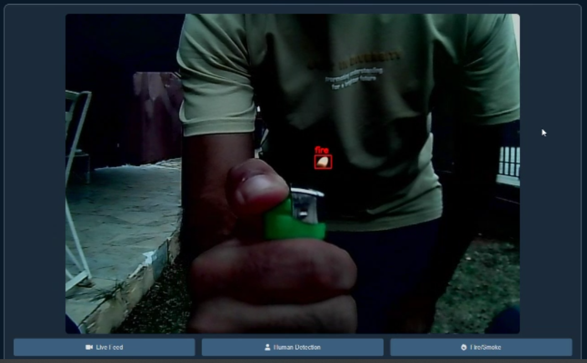

# Autonomous UAV System for Rapid Disaster Reconnaissance

**Final Year Project — La Sagesse University (2025) — Grade: A+**  
**Technical Lead:** Wadih Dahrouge · **Team:** Amine Batrouni, Houssam Hamdan  
**Supervisor:** Dr. Eng. Roy Abi Zeid Daou

A self-funded UAV prototype developed to support disaster reconnaissance in hazardous environments. The project explores autonomous waypoint missions, LiDAR-based obstacle avoidance, fire/smoke and human detection, and real-time situational awareness for first responders.

The system was formally presented to the **Lebanese Civil Defence**. A representative described the concept as “very interesting and indispensable” for Lebanon's wildfire response, noting that the lack of institutional funding was a major barrier to real-world deployment.

> **Scope and evidence:** This was a final-year prototype built under constrained conditions. The figures below are reported in the project materials and should be interpreted in that context. They are not all independently reproducible from this repository, and the repository does not establish that every subsystem was integrated and validated together on flight hardware.

---

## Why this project exists

Wildfires and other emergencies can put responders at risk and make rapid situational awareness difficult. This project explored a modular UAV workflow intended to help locate people, identify fire and smoke, sense environmental conditions, and relay information to a ground station.

The project was self-funded and developed in Lebanon during regional conflict in 2024–2025, when GNSS/network disruptions and restricted opportunities for outdoor testing affected validation. Testing therefore combined bench checks, simulation, and constrained real-world flight windows.

## Results reported by the project

| Metric | Reported result |
|---|---:|
| Human detection accuracy (YOLOv8) | **92%** |
| Fire detection accuracy | **80%** |
| Flight endurance | **18 minutes** |
| Assembled weight | **1.4 kg** |
| GPS positioning accuracy in field testing | **±2–3 m** |
| LiDAR obstacle-distance tolerance described in project testing | **±2 cm** |
| Environmental sensor figures | Humidity ±0.5% · Temperature ±2–3% · Air quality ±4.5 AQI |

These are project-reported figures; the repository does not include a complete benchmark dataset and protocol to independently reproduce every value. In particular, the ±2 cm figure should be read as the reported obstacle-distance tolerance, not as an independently verified 360-degree accuracy benchmark.

## System architecture


- **Flight control:** Pixhawk 2.4.8 running ArduCopter/ArduPilot, with MAVLink/MAVROS providing the flight-control interface. State estimation uses the flight controller's onboard EKF.
- **Autonomy stack:** ROS 2 components for mission execution, navigation, and obstacle-avoidance behavior, running on a Raspberry Pi 4B.
- **Perception:** YDLIDAR X4 Pro 2D scanning LiDAR for obstacle sensing and a front-facing camera for video. The LiDAR provides a 360-degree planar scan; it is not a 3D LiDAR.
- **Detection:** YOLOv8-based human detection and a pretrained CNN for fire/smoke detection, with inference described in the project materials as offloaded to a ground-station server.
- **Ground station:** Flask backend and web frontend using Leaflet, with WebSocket/ROSBridge communication for mission planning, telemetry, and detection overlays.
- **Additional sensing:** GPS/compass, landing-distance LiDAR, MQ-135 air-quality sensor, and SHT3x temperature/humidity sensor.



*Example detection output from project testing.*


## Real-world testing


Testing progressed from bench checks and simulation to constrained real-world flights. The project materials describe:

- Manual flight and IMU/ESC calibration.
- Mission validation in QGroundControl/Mission Planner, including safety-constrained tests.
- Open-field autonomous missions involving takeoff, multi-waypoint navigation, obstacle-avoidance checks, and return-to-launch.

The descriptions and images document project work; they are not substitutes for complete flight logs, a reproducible evaluation dataset, or independent replication.

## Constraints and lessons learned

- **Self-funded:** the team financed the project without institutional backing.
- **Difficult testing conditions:** regional conflict affected GNSS/network availability and limited outdoor flight-testing opportunities.
- **Compute constraints:** the Raspberry Pi 4B was constrained under multi-node ROS 2 workloads.
- **Not completed in this iteration:** thermal-camera integration and full 3D SLAM mapping.
- **Future work:** stereo vision, thermal imaging, secure communications, multi-UAV coordination, and onboard SLAM.

**Important limitation:** this project should not be described as demonstrating validated GNSS-denied autonomy or completed 3D SLAM. The YDLIDAR X4 Pro is a 2D scanning LiDAR, and the repository is a research/portfolio artifact rather than flight-ready software.

## Repository contents

| File | Description |
|---|---|
| [Autonomous UAV system final PDF.pdf](Autonomous%20UAV%20system%20final%20PDF.pdf) | Full final-year project report, including background, system design, and testing |
| [System architecture](architecture_block_diagram.png) | System block diagram |
| [Wiring schematic](wiring_schematic.png) | Hardware wiring schematic |
| [Detection output](detection_results.png) | Fire/smoke and human-detection example |
| [Flight-test image](uav_flight_2m_obstacle_test.jpg) | Obstacle-avoidance flight-test image |
| [ROS 2 setup guide](ROS2_SETUP.md) | Workspace setup, launch inspection, safety precautions, and verification limits |
| [Security notes](SECURITY.md) | Ground-station security considerations |

The source code includes ROS 2 packages and ground-station components. See the [UAV-side code](drone/) and [ground-station code](ground_station/).

## Running and verification

The software is hardware- and ROS-version-dependent. Before connecting flight-control hardware, review [ROS2_SETUP.md](ROS2_SETUP.md) and [SECURITY.md](SECURITY.md). The current Python checks do not build the entire ROS 2 workspace, validate the complete Flask/ROSBridge stack, evaluate model accuracy, or certify real UAV operation.

For ground-station development, install the development requirements and run the tests from the repository root:

```bash
python -m pip install -r requirements-dev.txt
python -m pytest -q
python -m compileall -q ground_station/server drone
```

Do not expose the ground station directly to the public internet. Verify the vehicle state and retain manual control during any flight testing.

## Author

**Wadih Dahrouge** · Mechatronics Engineer  
Focus areas: UAV robotics, autonomous systems, ROS 2, perception, and navigation.

[Email](mailto:wadihdahrouge1@gmail.com) · [GitHub profile](https://github.com/wadih553)

## License

Released under the [MIT License](LICENSE).
